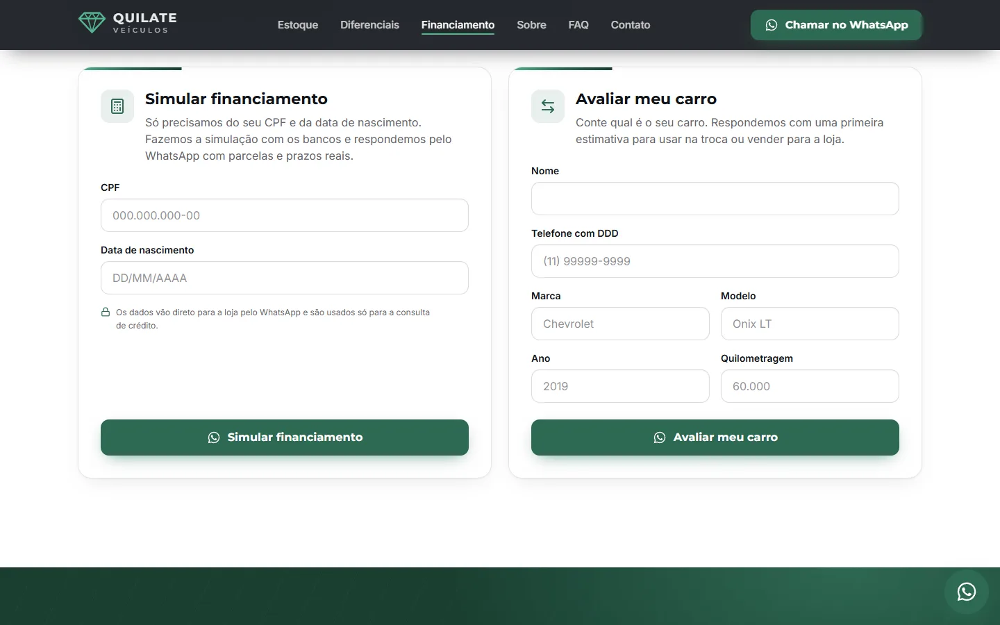

# Quilate Veículos · Landing page

[](https://github.com/juliocesarEL/Quilate_Veiculos/actions/workflows/ci-cd.yml)

Landing page para uma revenda de carros seminovos. O objetivo da página é um só: **gerar contato pelo WhatsApp**. Cada carro, formulário e botão abre uma conversa com a mensagem já escrita.

> **Projeto de demonstração.** A Quilate Veículos é uma loja fictícia: nome, logo, endereço, pessoas, depoimentos e estoque são inventados. Os botões de WhatsApp e Instagram levam aos contatos da [Risen Studio](https://www.instagram.com/risenstudio.dev/), autora do projeto. As fotos são do [Pexels](https://www.pexels.com/license/) (veja [Créditos](#créditos)).


<p align="center">
  
  &nbsp;
  
</p>

## Stack

| | |
| --- | --- |
| Framework | **Next.js 16** (App Router, Turbopack, Server Components) |
| Linguagem | **TypeScript** (modo `strict`) |
| Estilo | **Tailwind CSS v4**, com design tokens em `@theme` |
| Testes | **Vitest** e **Testing Library** (jsdom) |
| CI/CD | **GitHub Actions** e deploy na **Vercel** |
| UI | React 19, ícones `lucide-react`, fontes Montserrat e Inter servidas pelo projeto |

Nenhuma biblioteca de carrossel, animação ou formulário: tudo foi escrito com CSS e APIs nativas do navegador.

## O que tem na página

**Vitrine em carrossel** ([VitrineCarrossel.tsx](components/VitrineCarrossel.tsx))
- Rolagem nativa com `scroll-snap`, arrastar com o mouse sem quebrar os cliques dos botões, setas e navegação por teclado.
- Indicadores de posição sincronizados com `IntersectionObserver`.
- De 1 a 4 cards conforme a largura da tela, sem rolagem horizontal na página.
- Cada carro gera um link `wa.me` com marca, modelo, ano e preço na mensagem.


**Formulários que viram mensagem de WhatsApp** ([components/formularios/](components/formularios/))
- Simulação de financiamento com validação de CPF pelos dígitos verificadores e de data de nascimento (data inexistente, menor de 18 anos).
- Avaliação do usado com máscaras de telefone, ano e quilometragem.
- Erros acessíveis: `aria-invalid`, `aria-describedby` e foco no primeiro campo com problema.



**Animações só com CSS**
- Abertura do hero, revelação ao rolar e animações ligadas à rolagem (`animation-timeline`), com fallback para navegadores sem suporte.
- O JavaScript só marca quando um elemento entra na tela, com um único `IntersectionObserver` para a página toda.
- Com "reduzir movimento" ligado no sistema, tudo aparece direto no estado final.

**Acessibilidade e SEO**
- Menu mobile com foco preso, ESC para fechar e `inert` no painel fechado; acordeão do FAQ no padrão WAI-ARIA, com setas, Home e End.
- HTML semântico, um único `h1`, link "pular para o conteúdo" e foco visível em todos os elementos.
- Metadata completa, Open Graph, `sitemap.xml`, `robots.txt`, manifest e dados estruturados JSON-LD do tipo `AutoDealer`.

## Arquitetura

O código é organizado por responsabilidade, com dependências numa direção só: quem está em cima conhece quem está embaixo, nunca o contrário.

```
app/          Composição da página, metadata, SEO e estilos
  ↓
components/   Interface. Server Components por padrão
  ↓
hooks/        Estado de interface reutilizável (useFormulario, useEnvioWhatsApp)
  ↓
lib/          Regras puras: validação, máscaras, formatação, mensagens de WhatsApp
  ↓
data/         Conteúdo e modelo de dados tipado
```

Decisões principais:
- **Regras de negócio fora dos componentes.** Validação de CPF, idade mínima, ano do carro e montagem das mensagens são funções puras em `lib/`. Não dependem de React nem do navegador, por isso são testadas isoladamente e com data fixa.
- **Componentes pequenos e com uma responsabilidade.** Cada formulário só declara seus campos. Estado, validação ao digitar e foco no primeiro erro ficam no hook `useFormulario`; abrir o WhatsApp fica em `useEnvioWhatsApp`.
- **Dependências injetáveis onde há efeito colateral.** `abrirWhatsApp` recebe o `window` como parâmetro (com o real como padrão), o que permite testar o caso de pop-up bloqueado sem gambiarra.
- **Conteúdo separado da interface.** Loja, carros, FAQ e depoimentos ficam em `data/`. O tipo `Veiculo` já tem o formato de uma tabela de banco.
- **JavaScript só onde há interação.** São Client Components apenas o header, a vitrine, os formulários, o FAQ, a borda luminosa dos diferenciais e o observador de animações.
- **CSS por responsabilidade.** O [globals.css](app/globals.css) é só um índice que importa `tokens`, `base`, `reveal`, `hero`, `components` e `motion`, em [app/styles/](app/styles/).

### E Clean Architecture?

O projeto aplica as ideias centrais (regras isoladas da interface e dependências apontando para dentro), mas não cria as camadas formais de entidades, casos de uso, repositórios e adaptadores. Hoje todos os dados são estáticos e não existe operação de negócio que acesse algo externo: um repositório só repassaria um array, e um caso de uso só chamaria uma função pura. Seriam camadas sem comportamento, o que a própria Clean Architecture desaconselha.

Elas passam a valer a pena junto com o painel administrativo (ver [Próximos passos](#próximos-passos)): `ListarVitrine` e `CadastrarVeiculo` como casos de uso, uma interface `VeiculoRepositorio` com implementação em memória (testes) e outra no Supabase (produção). A estrutura atual já deixa esse caminho aberto: `lib/` vira o domínio e `data/` vira a implementação em memória.

## Testes

```bash
npm test             # roda uma vez (usado no CI)
npm run test:watch   # modo observação
```

37 testes em [tests/](tests/):
- **Regras** ([validacao.test.ts](tests/lib/validacao.test.ts)): CPF com dígito errado e sequências repetidas, 18 anos exatos hoje e amanhã, 29 de fevereiro em ano bissexto e não bissexto, data no futuro, ano do carro.
- **Formatação e mensagens** ([format.test.ts](tests/lib/format.test.ts), [whatsapp.test.ts](tests/lib/whatsapp.test.ts)): máscaras, preço, codificação do link `wa.me` e o comportamento com pop-up bloqueado.
- **Formulário de financiamento** ([FormFinanciamento.test.tsx](tests/components/FormFinanciamento.test.tsx)): testado como o visitante usa, digitando e enviando. Cobre máscaras, erros acessíveis, foco no primeiro campo inválido, erro que some ao corrigir e o link do WhatsApp gerado no envio.

Os testes foram conferidos quebrando uma regra de propósito (idade mínima de 18 para 10): dois testes falharam, como esperado.

## CI/CD

Pipeline em [.github/workflows/ci-cd.yml](.github/workflows/ci-cd.yml):

1. **CI** (em todo push e pull request): `npm ci`, lint, checagem de tipos, testes e build.
2. **Deploy** (só em push na `main` e só se o CI passar): build e publicação na Vercel pela CLI.

O deploy automático da Vercel na `main` está desligado em [vercel.json](vercel.json): quem publica é o pipeline, então código com teste quebrado nunca chega à produção. Pull requests continuam ganhando URL de preview pela integração da Vercel.

Para o deploy funcionar, cadastre em *Settings → Secrets and variables → Actions* do repositório:

| Segredo | Onde encontrar |
| --- | --- |
| `VERCEL_TOKEN` | Vercel → Account Settings → Tokens |
| `VERCEL_ORG_ID` | `.vercel/project.json`, depois de rodar `npx vercel link` |
| `VERCEL_PROJECT_ID` | `.vercel/project.json` |

Sem os segredos, o CI roda normalmente e o deploy só emite um aviso.

## Rodando o projeto

```bash
npm install
npm run dev        # http://localhost:3000
npm run build      # build de produção
npm run lint
npm run typecheck
npm test
```

Requer Node.js 20.9 ou superior (o CI usa Node 22).

## Qualidade

Medido com Lighthouse no perfil mobile, rodando localmente:

| Acessibilidade | Boas práticas | SEO | Performance |
| :---: | :---: | :---: | :---: |
| 100 | 100 | 100 | 76 a 79 (throttling simulado) · 95 (throttling real) |

- CLS 0: imagens com proporção fixa e fontes com fallback ajustado.
- Layout testado de 320px a 2560px, incluindo celular deitado, sem rolagem horizontal.
- Cabeçalhos de segurança em todas as respostas ([next.config.ts](next.config.ts)): proteção contra a página ser exibida em iframe de outro site, `nosniff`, `Referrer-Policy`, `Permissions-Policy` e HSTS. O pipeline roda com permissão só de leitura no repositório.
- Um caso de depuração que vale registrar: o build funcionava localmente e quebrava na Vercel com `next/font/google queries have exactly one entry`, uma falha do Turbopack ao baixar a fonte do Google Fonts no servidor. A solução foi servir as fontes pelo próprio projeto (`@fontsource-variable` com `next/font/local`), o que também tirou a dependência de rede do build.

## Estrutura

```
app/
  layout.tsx            Fontes, metadata, viewport e JSON-LD
  page.tsx              Ordem das seções
  globals.css           Índice dos estilos
  styles/               tokens, base, reveal, hero, components, motion
components/
  formularios/          Campo, CartaoFormulario, AvisoEnvio, FormFinanciamento, FormAvaliacao
  ui/                   Botão, cabeçalho de seção, logo e ícones de marca
  Hero, VitrineCarrossel, VeiculoCard, Diferenciais, FinanciamentoAvaliacao,
  Depoimentos, Sobre, Faq, Localizacao, Header, Footer, WhatsAppFloat
hooks/                  useFormulario, useEnvioWhatsApp
lib/                    validacao.ts, format.ts, whatsapp.ts
data/                   loja.ts, veiculos.ts, faq.ts, depoimentos.ts
tests/                  lib/ e components/
scripts/                gerar-icones-og.mjs (ícones e imagem de compartilhamento)
.github/workflows/      ci-cd.yml
```

## Próximos passos

- **Painel administrativo** para a loja cadastrar carros e fotos pelo celular, com Supabase (banco e storage), já nas camadas de casos de uso e repositórios descritas acima.
- **Testes do formulário de avaliação e da vitrine** (navegação por teclado e arraste).
- **Testes de ponta a ponta** com Playwright rodando no CI contra a URL de preview.
- **LCP do hero:** servir a foto principal em tamanhos menores no celular.

## Créditos

Fotos do [Pexels](https://www.pexels.com/license/), de uso gratuito inclusive comercial: [Volvo XC90](https://www.pexels.com/photo/white-suv-car-on-the-road-14776590/) · [Hyundai Santa Fe](https://www.pexels.com/photo/white-car-parked-in-the-garage-11194510/) · [Toyota Hilux](https://www.pexels.com/photo/black-toyota-hilux-pickup-truck-in-the-parking-lot-18240251/) · [Hyundai Tucson vermelho](https://www.pexels.com/photo/hyundai-tucson-on-dirt-road-during-sunset-12007134/) · [VW Golf Variant](https://www.pexels.com/photo/a-parked-volkswagen-golf-11567718/) · [BMW 320i](https://www.pexels.com/photo/white-bmw-car-parked-on-the-street-14776715/) · [Hyundai Tucson cinza](https://www.pexels.com/photo/gray-hyundai-tucson-19911371/) · [BMW X5](https://www.pexels.com/photo/white-vehicle-parked-on-dirt-road-7762700/) · [Honda Civic Type R](https://www.pexels.com/photo/honda-civic-type-r-on-the-street-in-city-16586236/) · [Toyota Land Cruiser](https://www.pexels.com/photo/white-toyota-land-cruiser-parked-in-forest-1683519/) · [Pátio](https://www.pexels.com/photo/line-of-modern-electric-cars-in-parking-lot-29566904/)

## Licença

O código está sob a [licença MIT](LICENSE). As fotos em `public/` são do Pexels e seguem a [licença do Pexels](https://www.pexels.com/license/); a marca Quilate Veículos é fictícia.

## Autor

**Julio Cesar** · [github.com/juliocesarEL](https://github.com/juliocesarEL)
